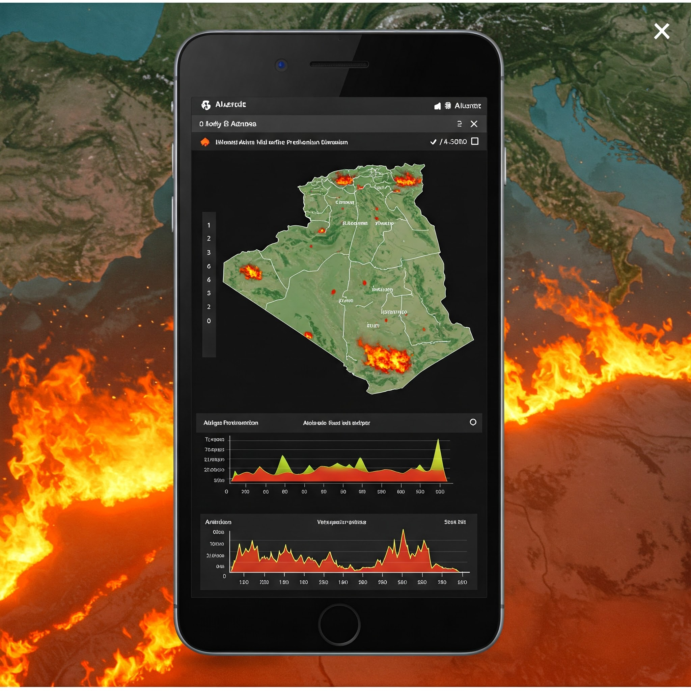
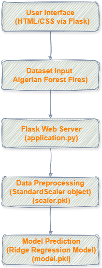
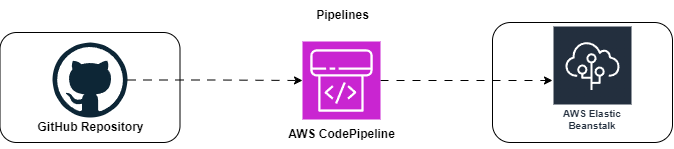

# 🔥 Algerian Forest Fire Prediction System

This project is a machine learning-based web application that predicts the occurrence of forest fires in the Algerian region using meteorological data. It demonstrates a complete end-to-end ML pipeline, from data preprocessing and model training to deployment using Flask and a clean, intuitive web interface.

##🌲 Objective

The primary goal is to predict forest fire occurrences based on environmental features such as temperature, humidity, wind speed, and rainfall. The model can assist environmental authorities and disaster management teams in early fire detection and prevention planning.

### 🧱 Project Architecture Diagram

The project follows a modular structure, integrating data processing, machine learning, and web deployment components

### 🔄 Workflow 

The workflow encompasses data handling, model training, and deployment phases:​

1. Data Collection:
   - Obtain Algerian Forest Fires dataset.

2. Data Preprocessing:
   - Clean and preprocess data.
   - Feature selection and scaling using StandardScaler.

3. Model Training:
   - Train Ridge Regression model on preprocessed data.
   - Evaluate model performance (e.g., R² score).

4. Model Serialization:
   - Save trained model as 'model.pkl'.
   - Save scaler object as 'scaler.pkl'.

5. Web Application Development:
   - Develop Flask application (application.py).
   - Create HTML templates for user input and result display.

6. Deployment:
   - Deploy Flask app to a web server (e.g., AWS Elastic Beanstalk ).
   - Users input data via web interface to get predictions.

### AWS Deployment Archetecture

### 🧠 Key Features
- **Data Preprocessing**: Handling missing values, feature selection, encoding, and normalization.

- **Model Training**: Multiple machine learning models were evaluated (e.g., Logistic Regression, Random Forest, SVM), with the best one chosen based on accuracy and precision.

- **Flask-Based Web App**: Users can input weather conditions and receive an instant prediction on whether a fire is likely to occur.

- **Modular Codebase**: Clean and maintainable code structure with separate modules for training, prediction, and deployment.

- **Model Serialization**: Trained model and preprocessing pipeline are saved using pickle for efficient reloading.

### 🧰 Tech Stack
- **Frontend**: HTML, CSS (with basic form-based UI)

- **Backend**: Flask (Python)

- **Machine Learning**: Scikit-learn, NumPy, Pandas

- **Deployment Ready**: Easily deployable on platforms like Heroku, Render, or local servers

### 📁 Dataset
- **Source**: UCI Machine Learning Repository – Algerian Forest Fires Dataset

- **Features**: Includes meteorological variables like temperature (Temp), relative humidity (RH), wind speed (Ws), rainfall (Rain), and more.

- **Target**: Binary classification – Fire or No Fire

### 🚀 How to Run

#### Clone the repository
git clone https://github.com/anulsasidharan/Algerian_Forest_fire_prediction.git

#### Navigate into the project directory
cd Algerian_Forest_fire_prediction

#### Install dependencies
pip install -r requirements.txt

#### Run the Flask app
python app.py
